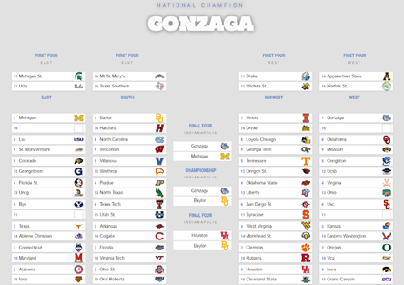

# KaggleMarchManiaBracket
This R Shiny App allows users to submit their [Kaggle March Mania](https://www.kaggle.com/c/ncaam-march-mania-2021/overview) predictions and returns a bracket visualization of the teams that their model would select to reach the Final Four and National Championship and the team that is predicted to win it all.

Here is an example of the visualization created by Michael Mayor and I's submission to the Kaggle competition.

As you can see, our model selected Michigan, Gonzaga, Houston and Baylor to be in the 2021 Final Four with Gonzaga projected to win the championship.

